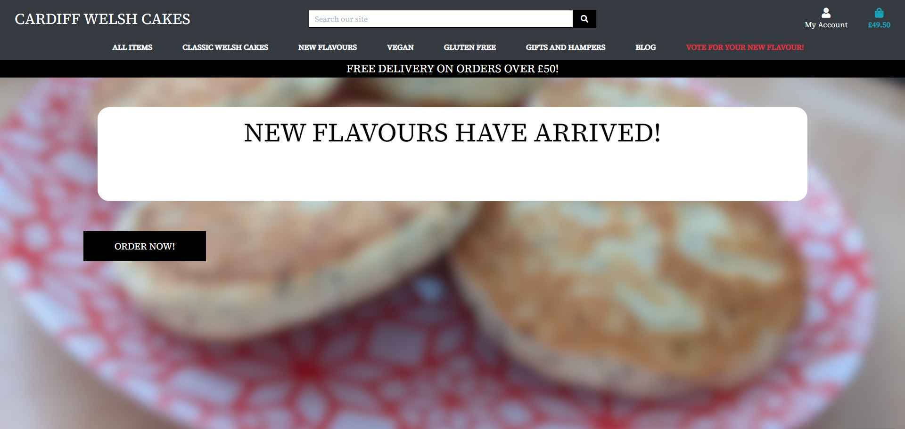
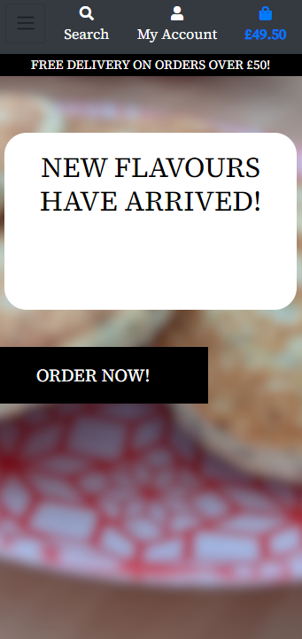

<h1 align="center">Milestone Project 4 - Cardiff Welsh Cakes</h1>

[View the live project here.](https://ms4-cardiffwelshcakes.herokuapp.com//)

For the MS4 brief, I have worked on a website that used Django, Stripe and other frameworks to create a fully functional online store to buy welsh cakes and gifts. Customers are able to browse, put items into a bag, check out items using their payment information and can leave comments on the site's blogging functionality. They can also vote on new flavours posted onto the sute by superusers.




# User Experience (UX)

# Strategy plane

## Aims of the website

The identified needs of the site have been measured as below: 

*   Provide users with a tool to search for items to purchase
*   Provide developers with a tool to gather welsh cake items to purchase using the website
*   Allow administration users to post blog and poll pages to update users on news and new items 
*   Provide users with an account to manage their cart, their payment details and their address


# Scope plane

*   A searchable database of items that users can browse and click on to view more information about an item's description or price
*   A blog system with the ability for users to leave comments, that can be approved by administrators
*   Design philosophy that is intuitive and does not need users to ask what they need to do to go forward
*   Use Django to use templates and views effectively to seamlessly move between different pages and areas of the website
*   Image upload functionality for each item
*   Polling for users to vote on new items, or other topics posted by administration

# Structure plane

This website has a base.html page that provides the skeleton structure of the site. Other pages feed in to this structure, implementing logic where needed to display different information. For example, if the polling page has no current votes on the page, it will tell the user that no polls are currently active.

Users must be able to exit out of a page and back to the search results if needed, either by using the navbar or by using buttons on the current form or page.


*   Consistency – Pages must look, feel and interact in a consistent way. This applies to dropdown fields for developers as well as selecting fields in a table

*   Predictability – The website must respond in a predictable manner - particularly important when users wish to purchase items using sensitive information. Toast messages provide the user with updates based on their status, for example, if a user needs to put more items in their bag to reach the free delivery limit.

*   Learnability – Features must be intuitive and feature single-click learning to prevent visitors becoming frustrating and clicking away

*   Visibility – Features must be visible, with content hinting included as appropriate

*   Feedback – Input fields and clickable events should respond in a way that assures the user that an event is progressing. Form fields have data verification - for example, if a user inputs an email address incorrectly.

## Database/Model Structure

The items in this website are relational. The structure is as follows:

**1.  categories**

    name:
    friendly_name:

**2.  products**

    sku: Unique database number.
    name: Item name.
    description: Text content.
    price: Item price.
    category: Category of the item.
    rating: Rating number.
    image_url: 
    image:

The models used in this website allow a superuser to create items in the following format:

**1.  blogs**

    title: Blog title.
    slug: Generates the slug for the URL.
    author: Blog author (superuser account)
    updated_at: If the post was updated, displays the date.
    content: Text content.
    created_at: Creation date.
    status: Draft or Published statues available.

**2.  comments**

    post: This field grabs the post that the comments relate to.
    name: Name of the poster.
    email: Email of the poster.
    created_on: Date of the comment.
    body: Text content.
    active: Admin uses this field to approve a comment.

**3.  checkout**

    order_number: unique order number generated for the user.
    user_profile: user's currently logged in account.
    full_name: name of the user.
    email: email of the user.
    phone_number: Contact number of the user.
    country: Country of the user.
    postcode: Postcode of the user.
    town_or_city: City of the user.
    street_address1
    street_address2: Address of the user.
    county
    date
    delivery_cost: Delivery cost set in the backend.
    order_total: Combined total of items in the bag.
    grand_total: Combined total of delivery (if applicable) and the items in the bag.


# Skeleton plane

## Wireframes

-   Starting state - [View](wireframes/desktop/Starting_state.png)

-   Product listings - [View](wireframes/desktop/Product_listings.png)

-   Bag listings - [View](wireframes/desktop/Bag_listings.png)

-   Payment page - [View](wireframes/desktop/Payment_page.png)

-   Checkout page - [View](wireframes/desktop/Confirmation_page.png)

-   Blog overview - [View](wireframes/desktop/Blog_overview.png)

-   Poll pages - [View](wireframes/desktop/Polling.png)

##  Site structure

-   Registering an account requires an email, a password and a username. Users will then be able to see their personal information. Session storage can store contents of their bag. Users can also leave comments on blog posts.
-   Superusers can add extra items on the website's front end. This requires entering data into a form (with data validation) with an optional image if needed.
-   When adding items to a bag, users are provided with toast messages in the top right of the screen that update them on their current purchase status (including if they decide to edit or remove an item). 
-   Pages add to the base structure of the website using Jira and for/if statements that show certain pages depending on logic. Django also displays other templates depending on the URL returned. 
-   Admin users have the ability to edit and delete users, products, blogs, polls and categories. Admin users cannot delete other admin users.
-   In future versions of this build, I would plan to add the ability to 'wishlist' items that users can look at on their profile. This would be separate to the checkout bag as it would be a sharable list of items.

    
# Surface plane

## Colour Scheme
I have chosen a dark colour style, using white text or lighter colours to differentiate information like descriptions or prices. Blog entries and poll entries use the Bootstrap card functionality to differentiate different entries from each other.

## Icons
Font Awesome icons have been utilised in this project to provide more style to the page. 

# User stories

## First Time Visitor Goals

1. As a First Time Visitor, I want to search for items that I am interested in buying and learning more about them.
2. As a First Time Visitor, I want to be able to create an account to purchase items and use my personal information to get them delivered to me.

## Returning Visitor Goals

1. As a Returning Visitor, I want to be able to return the cart that I had filled previously.
2. As a Returning Visitor, I want to be able to learn more about the store through extra information in blog posts.

## Super User Goals

1. As a Super User, I want to be able to add blog posts and polling for users to interact with.
2. As a Super User, I want to be able to use CRUD to create, remove, edit or delete products, users, categories or blog posts.


## Technologies Used

### Languages Used

-   [HTML5](https://en.wikipedia.org/wiki/HTML5)
-   [CSS3](https://en.wikipedia.org/wiki/Cascading_Style_Sheets)
-   [JavaScript](https://en.wikipedia.org/wiki/JavaScript)
-   [Python](https://en.wikipedia.org/wiki/Python)
-   [Jinja:](https://jinja.palletsprojects.com/en/2.10.x/)


### Frameworks, Libraries & Programs Used

1. [Django](https://www.djangoproject.com/)
    - This is the Python framework that is used for its functionality with models and views.
2. [Font Awesome:](https://fontawesome.com/)
    - Font Awesome has been used for icons used in parts of the site.
3. [jQuery:](https://jquery.com/)
    - jQuery has been used to enable certain browser functionality and Bootstrap functions.
4. [Git](https://git-scm.com/)
    - Git has been used as a version control system, which enables viewers to see the deployment history and design process. Github has been used as a storage for this info.
5. [GIMP:](https://www.gimp.org/)
    - GIMP was used to resize images, export to .jpg and .png and recolour some images.
7. [Gunicorn:](https://pypi.org/project/gunicorn/)
    - Gunicorn is a Python WSGI HTTP server that enables deployment to Heroku.
8. [Stripe:](https://stripe.com/gb)
    - This is the website that handles secure payment processing for the site.
9. [Crispy Forms:](https://django-crispy-forms.readthedocs.io/en/latest/)
    - Allows developers to control rendering behaviour of Django forms efficiently.
10. [Balsamiq:](https://balsamiq.com/)
    - Balsamiq has been used for the wireframes attached to this project.
10. [AWS S3 Buckets:](https://aws.amazon.com/)
    - to store media files (images, in the main) for the site.
10. [Boto3:](https://balsamiq.com/)
    - Allows Python to interact with AWS
10. [Balsamiq:](https://balsamiq.com/)
    - Balsamiq has been used for the wireframes attached to this project


## Testing

Testing has been implemented using tests.py files and manual debugging.

An example of automated testing is as follows:

    Class PostTests(TestCase):

        def setUp(self):
            """ Create a test post """
            self.post = Post.objects.create(
                title = "Test",
                slug = "test",
                author = User.objects.create_user("username", "email@email.com", "password"),
                content = "Test post",
            )

        def test_blogpost(self):
            """ Test post content returns correctly """
            post = Post.objects.get(id=1)
            expected_object_title = f'{post.title}'
            expected_object_slug = f'{post.slug}'
            expected_object_author = f'{post.author}'
            expected_object_content = f'{post.content}'
            self.assertEquals(expected_object_title, 'Test')
            self.assertEquals(expected_object_slug, 'test')
            self.assertEquals(expected_object_author, 'username')
            self.assertEquals(expected_object_content, 'Test post')

        def test_post_list_view(self):
            """ Ensure the blog list displays properly """
            response = self.client.get(reverse('blog'))
            self.assertEqual(response.status_code, 200)
            self.assertTemplateUsed(response, 'index.html')

Coded testing uses tests.py to create 'dummy' products, blogs and polling sessions, and can then test to ensure the completed dummy products are posted correctly.

The W3C Markup Validator, W3C CSS Validator and JS Hint services were used to validate the project.

-   [W3C Markup Validator](https://jigsaw.w3.org/css-validator/)
-   [W3C CSS Validator](https://jigsaw.w3.org/css-validator/)
-   [JS Hint](https://jshint.com/)
-   [PEP8](http://pep8online.com/)


### Responsiveness

-   The website has been designed with a mobile-first approach, so all fields should be responsive and should provide ease of use on mobile or tablet devices. 
-   The website has been tested on mobile, tablet and desktop devices.

### Further Testing

-   The website has been tested using Chrome Developer Tools to ensure any interactions operate correctly (through manually enabling selectors such as :hover or :active)
-   The website has been tested by other people and feedback has been gathered and acted on.

### Further features

-  Future features will implement pagination for the blog and defensive programming.


## Deployment
This project was developed using [GitPod](https://www.gitpod.io/) and
using Git for version control. It is deployed using [Heroku](https://heroku.com/).

### Local Deployment
To be able to run this project, install the following:
- An IDE of your choice.
- [Git](https://git-scm.com/)
- [PIP](https://pip.pypa.io/en/stable/installing/) 
- [Python3](https://www.python.org/download/releases/3.0/)    

Apart from that, you also need to create accounts with the following services:
- [Stripe](https://stripe.com/en-ie)
- [AWS](https://aws.amazon.com/) to setup the [S3 basket](https://docs.aws.amazon.com/AmazonS3/latest/gsg/CreatingABucket.html)
- [Gmail](https://mail.google.com/)
- [Heroku](https://heroku.com/)

#### Directions
1. You can clone this repository directly into the IDE of your choice by pasting the following command into the terminal:   
`git clone (repo-link-goes-here)
Alternatively, you can save a copy of this repository by clicking the **Clone or download** button, and extracting files from the ZIP file to your PC.

2. Set up environment variables.     
 The following syntax will be needed:    
    ```bash 
    import os  
    os.environ["DEVELOPMENT"] = "True"    
    os.environ["SECRET_KEY"] = "<KEY GOES HERE>"    
    os.environ["STRIPE_PUBLIC_KEY"] = "<KEY GOES HERE>"    
    os.environ["STRIPE_SECRET_KEY"] = "<KEY GOES HERE>"    
    os.environ["STRIPE_WH_SECRET"] = "<KEY GOES HERE>"    
     ```
       
3. Type `pip3 install -r requirements.txt`     
4. Type `python3 manage.py makemigrations` and `python3 manage.py migrate` to migrate the models. 
5. Type `python3 manage.py loaddata categories` and `python3 manage.py loaddata products`        
6. Type `python3 manage.py createsuperuser` to create an admin user.
7. Type `python3 manage.py runserver` to launch a local hosted version of the site. Add `/admin` to use the admin panel.

### Heroku Deployment
   
To deploy the project to [Heroku](https://heroku.com/) the following steps need to be completed:    
1. Install the following: **gunicorn**, **dj-database-url**, **Psycopg**
2. Type`pip3 freeze > requirements.txt` to create a list of dependencies.
3. Create a Procfile, and inside, type: `web: gunicorn art_of_tea.wsgi:application`    
4. Commit and push these changes.   
5. Visit [Heroku](https://heroku.com/) to create a free app.     
6. In Heroku's settings, add the config vars as set out below: 

| KEY            | VALUE         |
|----------------|---------------|
| AWS_ACCESS_KEY_ID | `<your aws access key>`  |
| AWS_SECRET_ACCESS_KEY | `<your aws secret access key>`  |
| DATABASE_URL| `<your postgres database url>`  |
| EMAIL_HOST_PASS | `<your email password(generated by Gmail once 2FA has been activated)>` |
| EMAIL_HOST_USER| `<your email address>`  |
| SECRET_KEY | `<your secret key>`  |
| STRIPE_PUBLIC_KEY| `<your stripe public key>`  |
| STRIPE_SECRET_KEY| `<your stripe secret key>`  |
| STRIPE_WH_SECRET| `<your stripe wh key>`  |
| USE_AWS | `true`  |


7. Copy **DATABASE_URL** to be used in **settings.py** as follows, saving before continuing:
  
```bash 
  DATABASES = {     
        'default': dj_database_url.parse("<your Postrgres database URL here>")     
    }
  ```
Do not commit this change as it contains sensitive information. This will be changed shortly. 
9. Type: `python3 manage.py makemigrations`, `python3 manage.py migrate`     
10. Type `python3 manage.py loaddata categories` and `python3 manage.py loaddata products`       
11. Type `python3 manage.py createsuperuser` to create an admin user for the Postgre database.    
12. Revert the change made in **settings.py**. 
13. Add your Heroku app URL to **ALLOWED_HOSTS** in the settings.py file.
14. In Heroku, select the Deployment method to GitHub, and select **Enable Automatic Deploys**. Type `git push` to push changes to GitHub and Heroku.
15. After successful deployment, you can view your app using the URL specified when creating the app in Heroku.

##### Hosting media files with AWS
Images are hosted in the [AWS S3 Bucket](https://aws.amazon.com/). To host them, you need to create an account in AWS and create your S3 basket with *public access*. More about setting it up you can read in [Amazon's S3 documentation](https://docs.aws.amazon.com/AmazonS3/latest/gsg/CreatingABucket.html).

##### Sending email via Gmail
In order to send real emails from the application, you need to connect it to a **Gmail account**. Two Factor Authentication needs to be enabled for the email to work with sending emails. Remember to add the variables to **settings.py** and Heroku's config vars.

# Credits

### Content

-   CodeInstitute's sample README was used as a guide on how to document a comprehensive design process, and I used this template to inform the layout of my own design journey.


### Media

-   Images are sourced by myself using Google's search engine to find Creative Commons licence images.

### Code

-   App ideas and code advice was provided by [Stack Overflow](https://stackoverflow.com/),  [Django Central's tutorials](https://djangocentral.com/building-a-blog-application-with-django/) and [Django's documentation](https://docs.djangoproject.com/en/4.0/intro/tutorial01/). CodeInstitute's practice website was used as a basis to work upon given the complexity of the task.

### Acknowledgements

-   Guido Cecilio for useful and helpful feedback during mentoring sessions.

-   Code Institute for the Slack channel and tutor support when encouring technical issues or sudden Gitpod updates, and for advice and guidance on how other students have approached the task.

-   Stack Overflow for helpful tips on specific questions I had during the creation of this project.

-   Django Central for helping with Django concepts.
